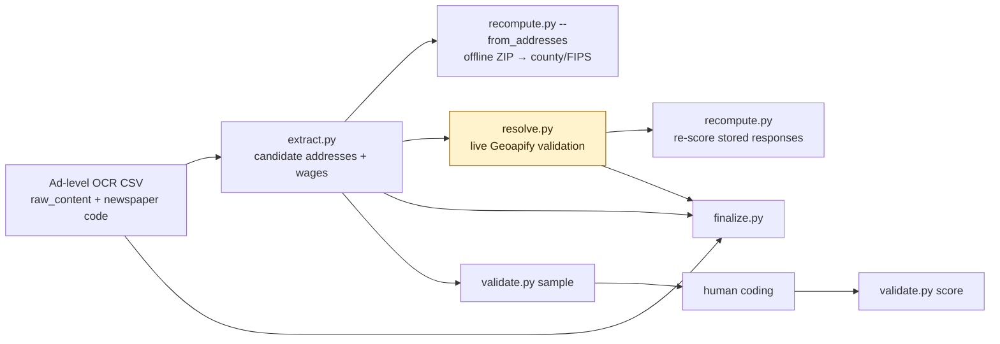

# newslabor-extract

[](https://github.com/mkmacho/newslabor-extract/actions/workflows/tests.yml)

Research software for extracting candidate employer locations and offered wages
from noisy OCR of historical newspaper job advertisements.

> [!IMPORTANT]
> I contributed research software and data engineering to historical
> job-advertisement research led by Joan Martínez and Ellora Derenoncourt. I am
> **not a coauthor of the paper**, and this repository is not an official paper
> replication package. I used OpenAI Codex and Anthropic Claude to assist with
> the 2026 audit, refactoring, testing, and public-release documentation. I
> reviewed the resulting work and accept responsibility for what is included
> here. See [ACKNOWLEDGMENTS.md](ACKNOWLEDGMENTS.md).

The production source collection available during development contained roughly
34 million ad-level OCR records across thirteen newspapers. That figure describes
the source-processing problem, not a paper estimation sample. The licensed
production corpus and research outputs are not distributed here. The runnable
example uses 2,000 generated advertisements with synthetic OCR damage.

## What the software does

The pipeline keeps source text alongside derived fields and can:

- extract address candidates around street markers and ZIP codes;
- extract and parse wage strings into amount, period, range, and ambiguity fields;
- validate address candidates through Geoapify when a user supplies an API key;
- derive county names and five-digit FIPS codes offline when a candidate contains
  a usable ZIP code;
- re-score stored geocoder responses without making new API requests;
- merge checkpoints, assemble a final dataset, and draw a weighted human-coding
  sample for accuracy assessment.



Only `resolve.py` makes geocoding requests. The offline county path is useful for
demonstration and for ZIP-bearing candidates, but it is not a substitute for
validating all candidate street addresses.

## Quick start: offline synthetic demo

Use Python 3.10 or 3.11; the local release checks ran on both. The Requests and
PyArrow pins require at least 3.10, while pandas 1.5.3 does not publish wheels
above 3.11.

```bash
python3.11 -m venv .venv
source .venv/bin/activate
python -m pip install -r requirements.txt
bash scripts/demo.sh
```

The demo itself needs neither an API key nor network access. It performs
extraction, ZIP-based county/FIPS assignment, and validation-sample creation on
`test_data/NJG-sample.csv`. By default it writes:

- `demo-output/NJG-extract-batch-2000.gzip`
- `demo-output/NJG-extract-all.gzip`
- `demo-output/NJG-extract-all.csv`
- `demo-output/NJG-offline-county-all.gzip`
- `demo-output/validation-sample.csv`
- `demo-output/validation-sample-CODEBOOK.md`

The demo explicitly enables the extract CSV because its source rows are
synthetic. Production commands default to Parquet only.

Pass an output directory as the first argument if desired:

```bash
bash scripts/demo.sh ./my-demo-output
```

The synthetic rows were generated to exercise known edge cases. Their behavior
is a regression fixture, not an estimate of accuracy on historical newspapers.

## Input contract

`extract.py` expects a CSV with:

- `raw_content`: OCR text, with missing values permitted;
- a filename whose stem is a newspaper code or begins with that code and a
  hyphen (for example, `NJG.csv` or `NJG-sample.csv`): `ASA`, `ATC`, `ATL`,
  `BaS`, `BoG`, `ChT`, `HaC`, `LAS`, `LAT`, `NJG`, `NYr`, `NYT`, or `WaP`;
- preferably `year`, used to prevent five-digit pre-1963 strings from being
  treated as ZIP codes;
- preferably a stable `id`, required by `finalize.py` for downstream joins.

The first CSV column is read as the row index. Other columns are preserved in the
extract output. Parquet is the default throughout. `extract.py`, `resolve.py`,
and `finalize.py` write a CSV copy only with `--write_csv=1`; those copies retain
source text and, after live resolution, full provider payloads.

## Core commands

### Extract addresses and wages

```bash
python scripts/extract.py \
  --filepath=./test_data/NJG-sample.csv \
  --extract_wage=1 \
  --aux_dir=./auxiliary_files \
  --output_dir=./output
```

Defaults include serial execution, address extraction enabled, wage extraction
disabled, a place-population threshold of 15,000, and `./output` as the output
directory. CSV output is disabled. Use `--multiprocessing=1`, `--nworkers`, and
`--batch_size` only after checking memory and filesystem behavior on a
representative slice.

### Derive counties offline

From extracted address candidates:

```bash
python scripts/recompute.py --from_addresses \
  --filepath=./output/NJG-extract-all.gzip \
  --output_dir=./output
```

From previously stored Geoapify responses, omitting `--from_addresses` re-applies
the current selection rules without any network requests:

```bash
python scripts/recompute.py \
  --filepath=./live-output/NJG-resolve-all.gzip \
  --output_dir=./live-output
```

### Validate candidates through Geoapify

This path sends candidate address strings to an external service and may incur
charges. Review the provider's terms and set a rate compatible with your plan.

```bash
export GEOAPIFY_API_KEY='<your-key>'
python scripts/resolve.py \
  --filepath=./output/NJG-extract-all.gzip \
  --rate_limit=5 \
  --output_dir=./live-output
```

The key is read from the environment and redacted from persisted request URLs.
The output still contains full response payloads in `geo_requests`; handle it as
research data. The default rate limit is `0` (unthrottled), so an explicit value
is recommended.

### Assemble a final dataset

`finalize.py` requires a live-resolve output containing `geo_requests`, the base
ad-level file, and optionally an extract output carrying wage columns:

```bash
python scripts/finalize.py \
  --geo=./live-output/NJG-resolve-all.gzip \
  --base=./test_data/NJG-sample.csv \
  --wage=./output/NJG-extract-all.gzip \
  --output_dir=./live-output
```

Parquet is the default final format. `--write_csv=1` creates an additional,
potentially large CSV containing the source text.

### Draw and score a human-validation sample

```bash
python scripts/validate.py sample \
  --filepath=./output/NJG-extract-all.gzip \
  --n=200 \
  --seed=20260816 \
  --out=./validation/NJG-sample.csv

# Complete the CSV using the generated CODEBOOK, then:
python scripts/validate.py score \
  --filepath=./validation/NJG-sample.csv
```

Sampling strata combine decade and whether the extractor emitted an address.
The template records design weights because empty-address rows and small decades
are deliberately over-sampled. Report the seed, coding rules, sample size,
uncertainty, and exclusions with any resulting accuracy estimate.

The score uses an approximate Wilson interval at the Kish effective sample size;
it does not apply a stratified finite-population correction or model coder error
or nonresponse. Reproduce the validation-design Monte Carlo with:

```bash
python scripts/verify_validation_design.py \
  --filepath=./output/NJG-extract-all.gzip \
  --simulations=500 \
  --seed=20260817
```

## Tests

The current suite collects 73 tests covering selected correctness, offline,
validation, determinism, and security invariants. It is not a substitute for a
hand-labeled evaluation on the intended historical corpus.

```bash
GEOAPIFY_API_KEY=not-a-real-key python -m pytest scripts/tests/ -q
```

The test configuration replaces the HTTP session with a stub that raises, so the
suite cannot make live requests. GitHub Actions also runs an end-to-end offline
smoke test on the bundled synthetic sample.

## Important limitations

- Address and wage extraction are rules-based and sensitive to OCR quality.
- Concatenated records are reduced to their first ad. Trailing ads may contain
  genuine text that does not appear as its own row.
- Candidate cities are limited to the newspaper's home and adjacent states and,
  by default, present-day ACS places with population at least 15,000.
- Present-day place, ZIP, and county references are applied to historical text.
- An address in an ad may be an application office or agency rather than a
  worksite; the pipeline cannot determine that from the address alone.
- OCR-split numbers can make `wage_amount` misleading. Inspect the original wage
  string and `wage_n_amounts` rather than treating every parsed amount as clean.
- Wage extraction requires a numeric amount; amounts written entirely in words
  are not parsed.
- Offline ZIP assignment covers only candidates with usable ZIP information.
- The synthetic demo does not establish external validity or production accuracy.

See [AUDIT.md](AUDIT.md) for the current verification record and methodological
risks that remain open.

## Repository map

| Path | Purpose |
|---|---|
| `scripts/extract.py` | address and wage extraction |
| `scripts/resolve.py` | live geocoder requests and response selection |
| `scripts/recompute.py` | offline ZIP assignment or stored-response re-scoring |
| `scripts/merge-batch.py` | checkpoint consolidation; deletion is opt-in |
| `scripts/finalize.py` | join geolocation and wage fields to a base dataset |
| `scripts/validate.py` | weighted coding-sample creation and scoring |
| `scripts/verify_validation_design.py` | reproducible Monte Carlo check of the weighted validation estimator |
| `scripts/build_geo_reference.py` | reproducible rebuild of derived geography tables |
| `scripts/make_sample_corpus.py` | deterministic synthetic-corpus generator |
| `scripts/tests/` | regression and invariant tests |
| `AUDIT.md` | current audit scope, safeguards, and limitations |
| `NOTICE` | third-party data provenance and license notices |
| `ACKNOWLEDGMENTS.md` | contributor roles and AI-assistance disclosure |
| `LICENSE` | rights statement and third-party carve-outs |

## Data, credit, and license

The production advertisement corpus is not included. The bundled demonstration
data are synthetic; geography tables combine U.S. Census Bureau and GeoNames
sources, and the state-adjacency table retains its upstream MIT terms. Read
[NOTICE](NOTICE) before redistributing any data file.

No project-wide open-source license is granted. The repository is publicly
viewable as a research-software and portfolio artifact; rights remain with their
respective holders. See [LICENSE](LICENSE) for the precise scope and
[ACKNOWLEDGMENTS.md](ACKNOWLEDGMENTS.md) for contributor roles and AI assistance.
